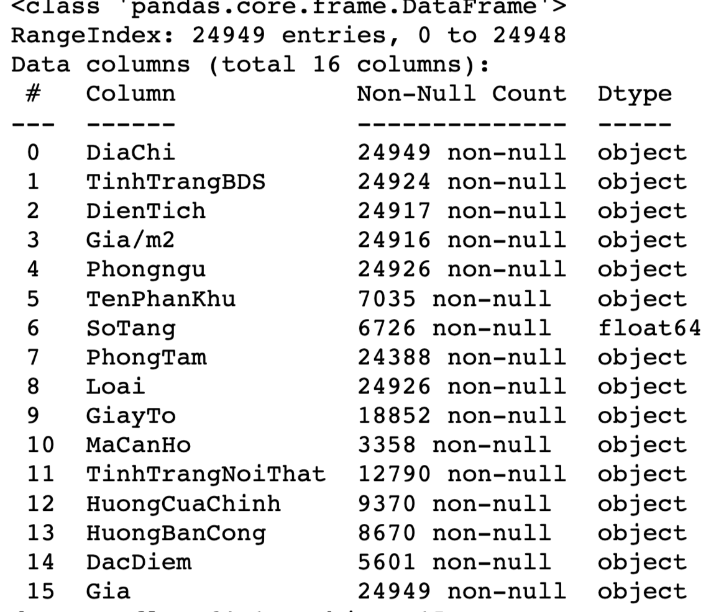
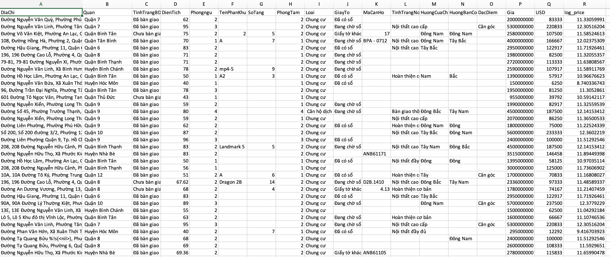
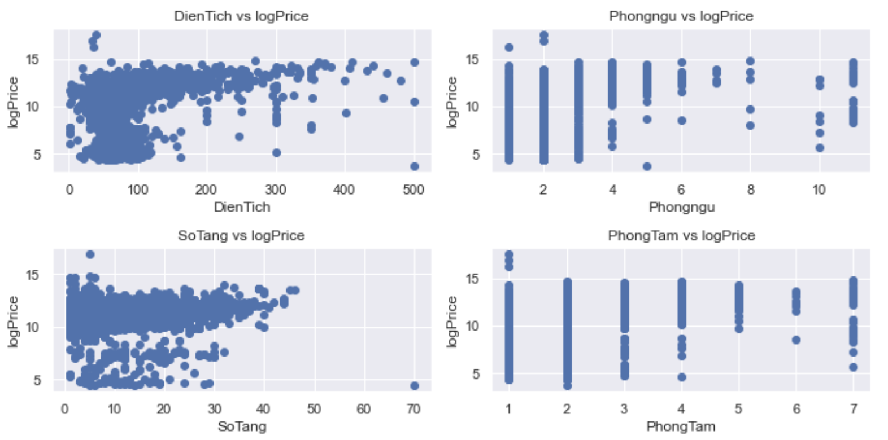
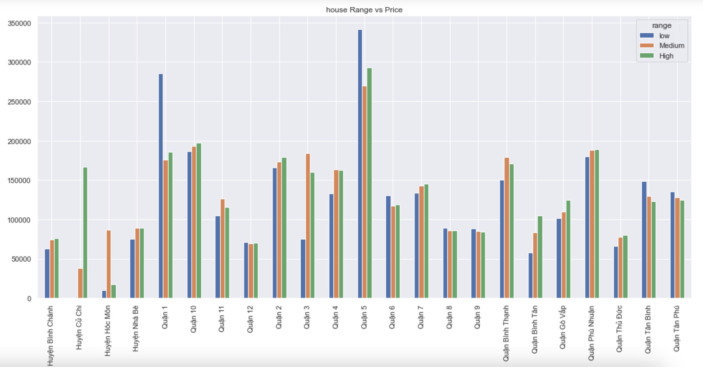
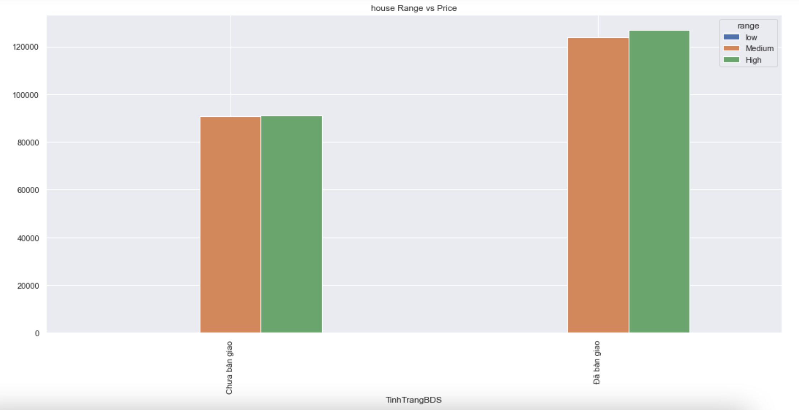
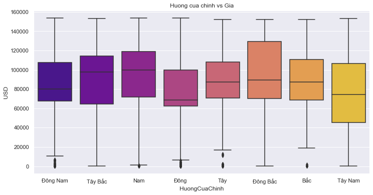
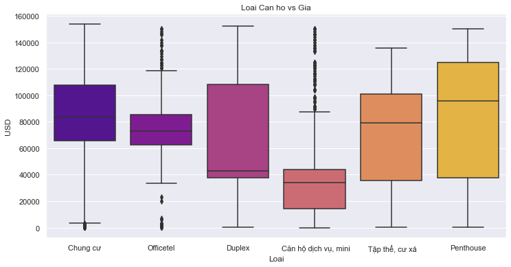
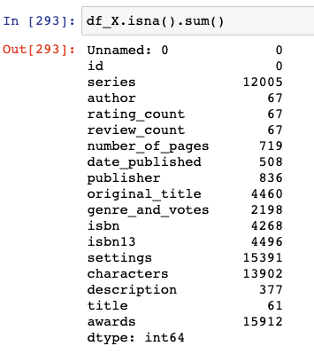
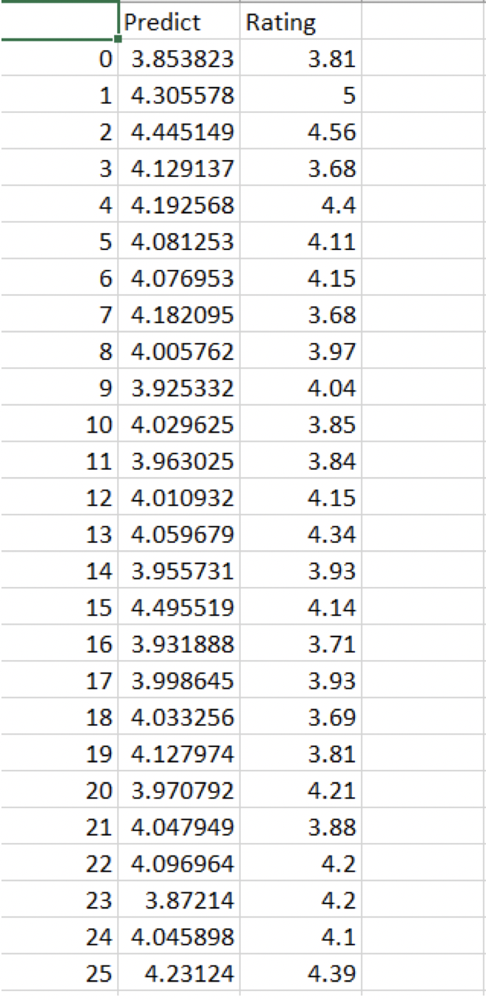

<h1>BÁO CÁO ĐỒ ÁN CUỐI KÌ - KHOA HỌC DỮ LIỆU ỨNG DỤNG</h1>
<h2>Cấu trúc folder đồ án</h2>

  - **Chotot:** chứa file **code** và **datasdet** của **bài toán 1**
  - **images:** chứa các hình ảnh screenshot
  - **Rating:** chứa file **code** và **dataset** của **bài toán 2**
  - **README.MD:** chứa báo cáo đồ án
<h2>1. Thành viên nhóm và phân công</h2>

* Thành viên 
  * Trịnh Vũ Minh Hùng, MSSV: 1712049
  * Nguyễn Văn Khoa, MSSV: 1712072    
* Phân công:
    | Thành viên | Công việc |
    | ----------- | ----------- |
    | Trịnh Vũ Minh Hùng | <ul> <li>Phát biểu bài toán, đặt ra câu hỏi từ đó đặt ra các yêu cầu để thu thập dữ liệu</li><li>Thu thập dữ liệu nhà ở và trung cư từ trang [Chợ tốt](https://nha.chotot.com/)</li><li>Clean data</li><li>Viết báo cáo</li></ul>  |
    | Nguyễn Văn Khoa  | <ul><li>Thu thập dữ liệu từ trang [Chợ tốt](https://nha.chotot.com/)</li><li>Visualize các cột dữ liêụ để xây dựng dataset cho  bước training</li><li>Training với mô hình **Linear Regression** và đưa ra nhận xét</li></ul> |

<h2>2. Tổng quan đồ án</h2>

2.1. **Phát biểu bài toán**

- **Bài toán 1:** Dự đoán giá chung cư khu vực thành phố Hồ Chí Minh với tập dữ liêụ **24.949 entries** từ trang [Chợ tốt](https://nha.chotot.com/)
- **Bài toán 2:** Dự đoán **rating của 1 cuốn sách** theo đánh giá của trang  [Good reads](https://www.goodreads.com/) với tập dữ liệu gồm **22.500 entries**
  
2.2. **Quá trình thực hiện đồ án** : trải qua 2 giai đoạn với hai bài toán khác nhau.

  - **Giai đoạn 1**: Ở giai đoạn này, nhóm hướng đến bài toán **dự đoán giá chung cư và nhà ở** của khu vực **thành phố Hồ Chí Minh**. Sau đó, sử dụng phương pháp **parse HTML** để thu thập dữ liệu từ trang [Chợ tốt](https://nha.chotot.com/).
    - Thông tin về dữ liệu thu thập được: <br>
    - Vấn đề: Ở đây dữ liệu thiếu khá nhiều, và sẽ có một số cột không ảnh hưởng đến output giá chung cư nên sẽ phải tiền xử lý, trực quan hoá các cột dữ liệu để tìm ra dữ liệu nào được giữ lại để xây dựng cho quá trình traning ***(tiền xử lý và EDA dữ liệu sẽ được trình bày bên dưới)***

  - **Giai đoạn 2**: Sau khi thực hiện xong đồ án, nhóm thấy sai số của output là khá cao hơn 1 tỷ VNĐ. Lý do, bộ dữ liêụ thu thập được là không tốt ảnh hưởng lớn đến quá trình traning do đó nhóm đã làm thêm 1 bài toán khác đó là: **Dự đoán rating của một cuốn sách thông qua đánh giá của trang [Good reads](https://www.goodreads.com/), và sử dụng mô hình học máy để đưa ra kết quả cần thiết


<h2>3. Phân tích chi tiết</h2>

**3.1. Bài toán 1:**
  
  - Dữ liệu sau khi thu thập được bao gồm 24949 dòng:  &#8594; được lưu [rawdata.csv](./data/chotot/rawdata.csv) 

  - **Mô tả các biến**:
    - **DiaChi:** địa chỉ của chung cư, ở thành phố Hồ Chí Minh
    - **TinhTrangBDS:** là chung cư này đã bàn giao chưa, hay vẫn còn đang trong quá trìnhg xây dựng. 
    - **DienTich:** diện tích thực ở(sử dụng) trên sổ hồng, đơn vị: **triệu/m2**.
    - **PhongNgu:** số lượng phòng ngủ.
    - **TenPhanKhu:** căn hộ đó thuộc block nào trong khu chung cư ấý. Vì 1 khu chung cư có rất nhiều block, các block ở vị trí khác nhau sẽ có giá khác nhau.
    - **SoTang:** căn hộ nằm ở tầng thứ mấy.
    - **PhongTam:** số lượng nhà vệ sinh.
    - **Loại:** chung cư hay nhà ở xã hội.
    - **GiayTo:** giấy tờ pháp lý của căn hộ, có đang tranh chấp hay không, có hợp pháp hay không.
    - **MaCanHo:** mã căn hộ (giống như số nhà).
    - **TinhTrangNoiThat:** căn hộ đã có nội thất hay chưa(sofa, lò vi sóng, máy lạnh,...).
    - **HuongCuaChinh:** hướng cửa chính của căn hộ.
    - **HuongBanCong:** hướng ban công của căn hộ.
    - **DacDiem:** Đặc điểm căn hộ ( căn trong góc, hay căn chính giữa,...).
    - **Gia:** giá bán của căn hộ.
    <br>
  - **Tiền xử lý dữ liệu:**
    - Chỉ lấy các dòng dữ liệu có dữ liệu về: diện tích, phòng ngủ, phòng tắm và giá. Và đổi giá tiền từ VNĐ  USD (theo tỉ giá 1$2 ~ 24000)
    - Dữ liệu sau khi xử lý còn 
    - Cái nhìn tổng quan về data sau khi clean:
    &#8594; được lưu [dataset.csv](./data/chotot/dataset.csv) 
    <br>
  - **Trực quan hoá dữ liệu:**<br>
    - Trực quan dữ liệu giá trị **dạng số**:
    &#8594; phòng ngủ và phòng tắm không ảnh hưởng nhiều đến giá<br><br>
    - Tương quan giữa **quận** và **giá**:
    &#8594; **Quận 5 , Quận 10, Quận 1 , Quận Phú Nhuận** là những quận có giá chung cư **cao nhất**<br><br>
    - Tương quan giữa **tình trạng bđs** và **giá**:
    &#8594; Có thể thấy những **chung cư đã được bàn giao** có **giá cao hơn** so với **chưa được bàn giao**<br><br>
    - Tương quan giữa **tình trạng nội thất** và **giá**:
    &#8594; Nội thất được bàn giao thô được ưa chuộng trong những khu căn hộ với giá cao<br><br>
    - Tương quan giữa **loại chung cư** và **giá**:
    &#8594; Những căn chung cư có **giá trung bình đến cao** thường là **penthouse**<br><br>
    - Một số tương quan khác:
  
    &#8594; Có thể thấy trường dữ liệu **giấy tờ** **không** ảnh hưởng quá nhiều tới **giá nhà**<br><br>

  - **Chạy thuật toán đoán giá**:

**3.1. Bài toán 2:**
    
- Dữ liệu thu thập được gồm **22.500 dòng** với **20 trường dữ liệu**.
- **Mô tả các biến:**
  - **id** : ID của cuốn sách 
  - **title** : Tên của cuốn sách
  -	**link** : đường link dẫn đến cuốn sách đó
  -	**series**: Cuốn sách này có nằm trong series nào ko ?
  -	**author** : tác giả cuốn sách
  -	**author_link**: đường link dẫn đến thông tin về tác giả
  -	**rating_count**: Số lượng người rating
  -	**review_count**: Số lượng người để lại review
  -	**number_of_Pages** : Số trang của cuốn sách
  -	**date_published**: Ngày được xuất bản 
  -	**publisher** : Nhà xuất bản
  -	**original_title** : Tên gốc 
  -	**genre_and_votes**: Thể loại và lượt bình chọn 
  -	**isbn** : Mã số tiêu chuẩn quốc tế cho sách
  -	**isbn13**: Mã vạch
  -	**settings** : Bối cảnh diễn ra chính trong cuốn sách
  -	**characters**: Các nhân vật trong cuốn sách 
  -	**description**: Tóm tắt cuốn sách
  -	**awards** : Các giải thưởng mà cuốn sách nhận được
  -	**rating** : đánh giá trung bình của người đọc

- **Cách thu thập dữ liệu:**
  - Bước 1: Vào link ["list book on good reads"](https://www.goodreads.com/list/show/1.Best_Books_Ever) lấy ra link của tất cả các cuốn sách có trong goodread.
  - Bước 2: Từ đó sẽ vào từng link đã thu thập được ở trên để lấy thông tin chi tiết của từng cuốn sách. Cách làm là : chia dữ liệu ra làm nhiều phần để crawl trên colab nhằm giảm bớt thời gian lấy dữ liệu. Với mỗi trang colab ta lấy được 1 file csv.
  - Bước 3: Gộp hết vào thành 1 file [csv](/Rating/dataset.csv) duy nhất  và sử dụng python và anaconda để làm các bước tiếp theo. 

&#8594; **Tóm lại:** Hầu như tất cả các trường dữ liệu thu thập được đều có ít nhiều ảnh hưởng đến rating của cuốn sách . Một số khác như link , isbn , isbn13 ,… thì ko ảnh hưởng đến nên sẽ bị xóa đi trong quá trình xây dựng model. Chi tiết đều được viết đầy đủ trong file:  [Predict.ipynb](/Rating/Predict.ipynb)
  
- **Tiền xử lý dữ liệu:**
  - Drop 2 cột **link** , **author_link** do không liên quan đến sách và cột **settings** do quá nhiều **null values**. 
  - Xử lý data ở cột **series**: dữ liệu crawl được có dạng **(abc #x) &#8594; abc**
  - Xử lý data ở cột **date_published**: do có dòng có ngày đầy đủ, có ngày chỉ có năm &#8594; chuyển tất cả về năm.
  - Một số xử lý khác: được trình bày chi tiết trong file **[Predict.ipynb](/Rating/Predict.ipynb)**

- **Chạy thuật toán đoán giá**:
  - Bước 1: chia dữ liệu thành 2 tập
    - Tập train: x_train, y_train
    - Tập valid: x_valid, y_valid
  - Bước 2: Training data:
  ```python
  def save_model(model,model_name):
    with open(model_name + '.pkl', 'wb') as f:
      pickle.dump(model, f, pickleHIGHEST_PROTOCOL)

  def load_model(model_name):
    with open(model_name + '.pkl', 'rb') as f:
      return pickle.load(f)
  ```

   ```python
    from sklearn.svm import SVR
    from sklearn.pipeline import make_pipeline
    from sklearn.neural_network import MLPRegressor
    from sklearn.preprocessing import StandardScaler
  ```

  ```python
    # Linear Regression
    reg_LR = make_pipeline(StandardScaler(), LinearRegression())
    # Support Vector Regression
    reg_SVR = make_pipeline(StandardScaler(), SVR(C=0.5, gamma=0.1))
    # MLP Regression
    reg_MLPR = make_pipeline(StandardScaler(), MLPRegressor(random_state=1, max_iter=500))
  ```

- **Đánh giá thuật toán:**:
  - Với kết quả tập test chênh lệch khá thấp so với rating thực như hình dưới đây. Ta có thể thấy mô hình đã hoạt động rất tốt 
  
  

<h2>4. Hướng dẫn chạy các file code</h2>

  - **Bài toán 1: đoán giá nhà**
    - **Chotot_Scraping_Data.ipynb:** script thu thập data nhà từ trang cho tốt
    - **rawdata.csv:** data sau khi được crawl (data thô - chưa qua xử lý)
    - **dataset.csv:** data sau khi trải qua quá trình xử lý
    - **links_chotot.csv:** link của các ngôi nhà trên trang chợ tốt, ứng vói mỗi ngôi nhà sẽ crawl thông tin chi tiết.
    - **Predict.ipynb:** file thực hiện tiền xử lý dữ liệu và training data<br><br>

  - **Bài toán 2: đánh giá rating**
    - **Book_1.csv** : File lưu đường link của các cuốn sách trên trang goodread đã thu thập được 
    -	**X.csv** : File lưu giữ thông tin cụ thể của từng cuốn sách( không  có rating) 
    -	**Y.csv** : File lưu giữ thông tin về rating của từng cuốn sách 
    -	**Colab.txt** : Lưu đường link dẫn đến file crawl data 
    -	**Predict.csv** : Lưu kết quả dự đoán mô hình và kết quả thực trên trang goodread<br><br>
  